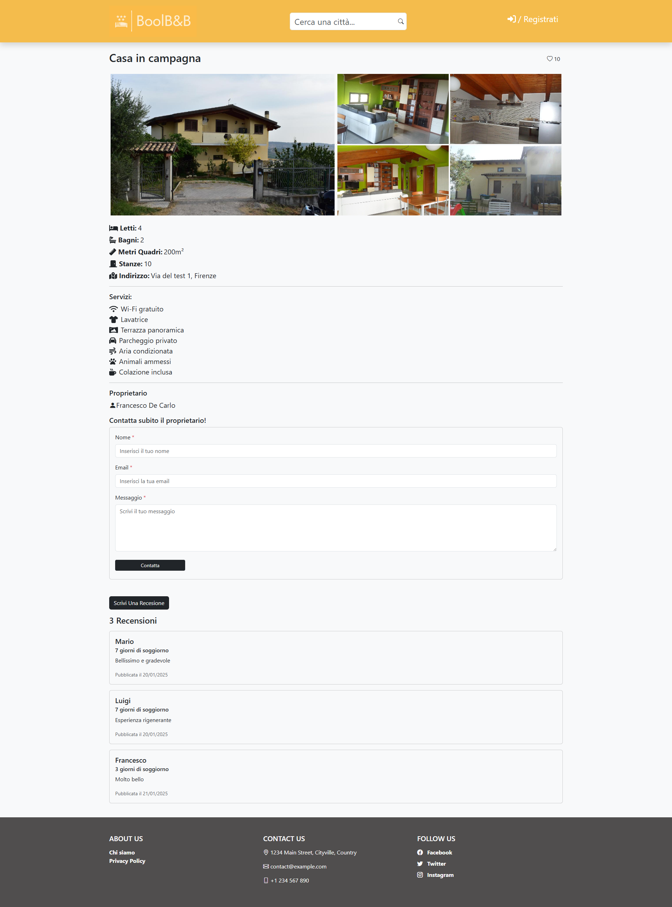
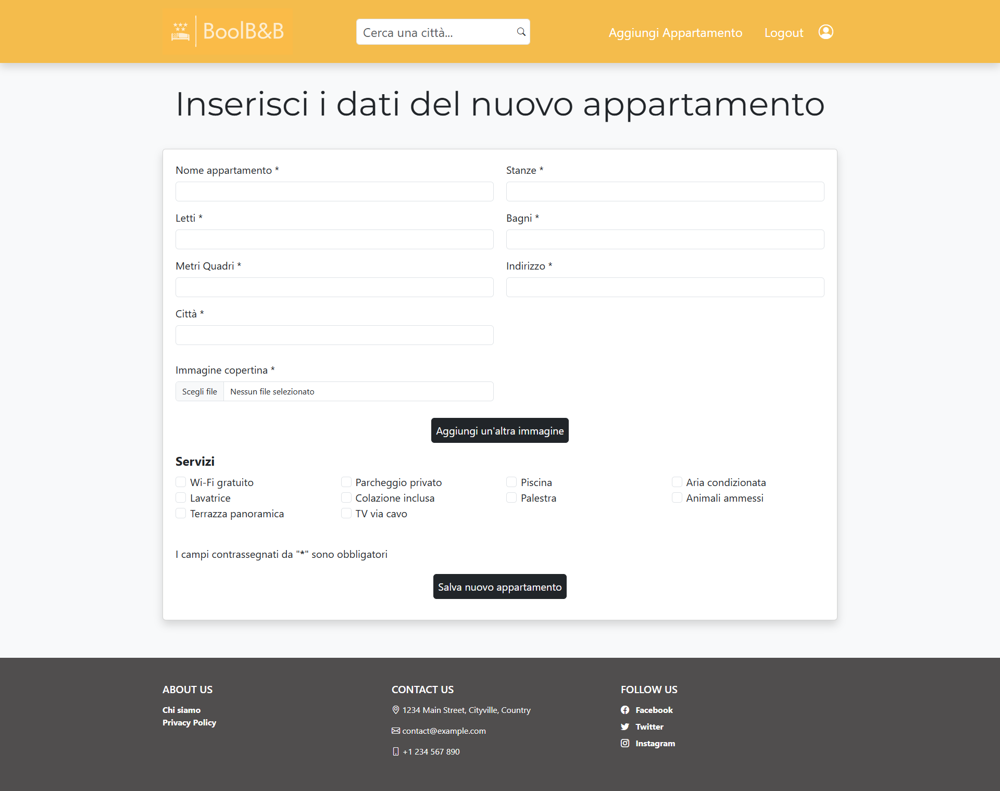

# WEB APP REPLICA DI AIRB&B
Una Web di visualizzazione appartamenti messi a disposizione da proprietari registrati. La Web App permette di registrare il proprio appartamento previa registrazione alla Web App. 

## DESCRIZIONE
Web App che permette di:
- visualizzare una homepage con tutti gli appartamenti disponibili con tutte le loro specifiche, barra di ricerca per città;
- pagina di ricerca avanzata dove è possibile selezionare il numero minimo di letti, bagni, stanze e metri quadri che un appartamento deve avere;
- pagina di dettaglio del singolo appartamento in cui è possibile aggiungere cuori di gradimento senza nessun limite, form per contattare il proprietario, form per lasciare una recensione;
- pagina di login o registrazione;
- pagina personale per gli utenti registrati dove è possibile visionare i propri appartamenti inseriti;
- pagina per l'aggiunta di un nuovo appartamento con all'interno un form da compilare per l'inserimento dell'abitazione

## CARATTERISTICHE CHIAVE
- Aggiungere curori di gradimento ad un appartamento;
- possibilità di cercare degli appartamenti per città e successivamente ricercare un appartamento specificando i dettagli;
- lasciare una recensione al proprietario;
- contattare il proprietario;
- registrazione per inserire il proprio appartamento;

## Risultato
- pagina principale
 

 

- pagina di dettaglio
 

 

- pagina di ricerca avanzata
 

 

- pagina di registrazione
 

 

- pagina di inserimento nuovo appartamento
 

 

### DIPENDENZE BACK-END
- express
- mysql2
- bcryptjs --> utilizzata per l'hash della password nel database
- cors
- joi --> utilizzata per le validazioni lato server-side
- multer --> utilizzata per il caricamento di file immagine salvati in locale e aggiungerli al database
- @sendgrid/mail --> utilizzata per il form "contatta il proprietario"

### DIPENDENZA FRONT-END
- react
- react-router-dom
- react-toastify 
- bootstrap
- bootstrap-icons
- fontawesome
